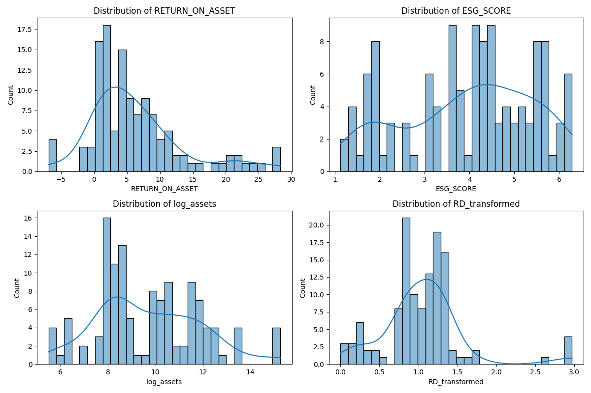
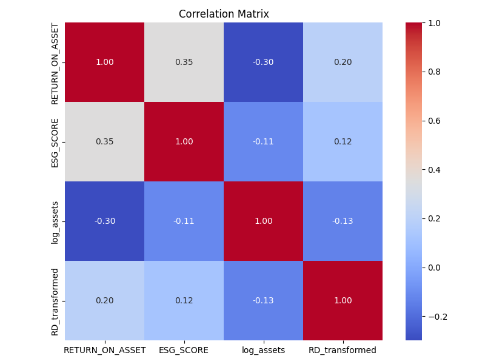
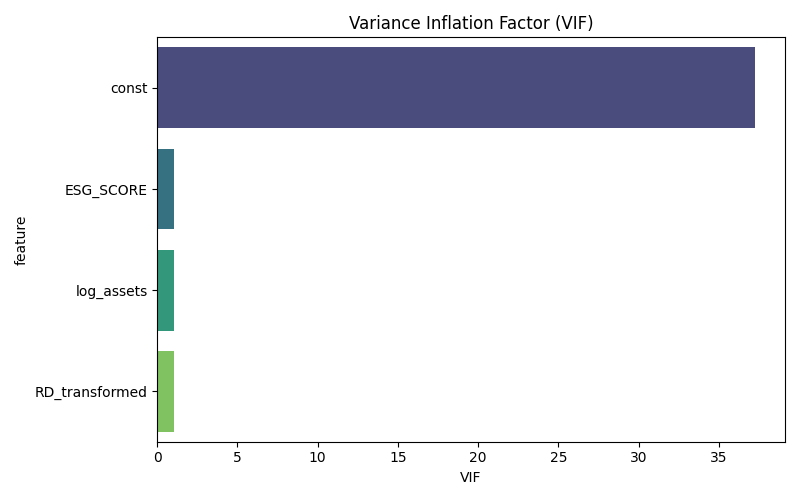
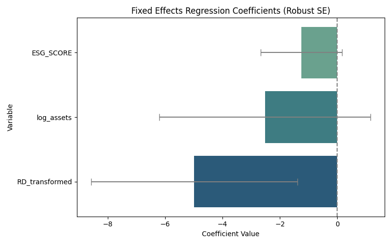
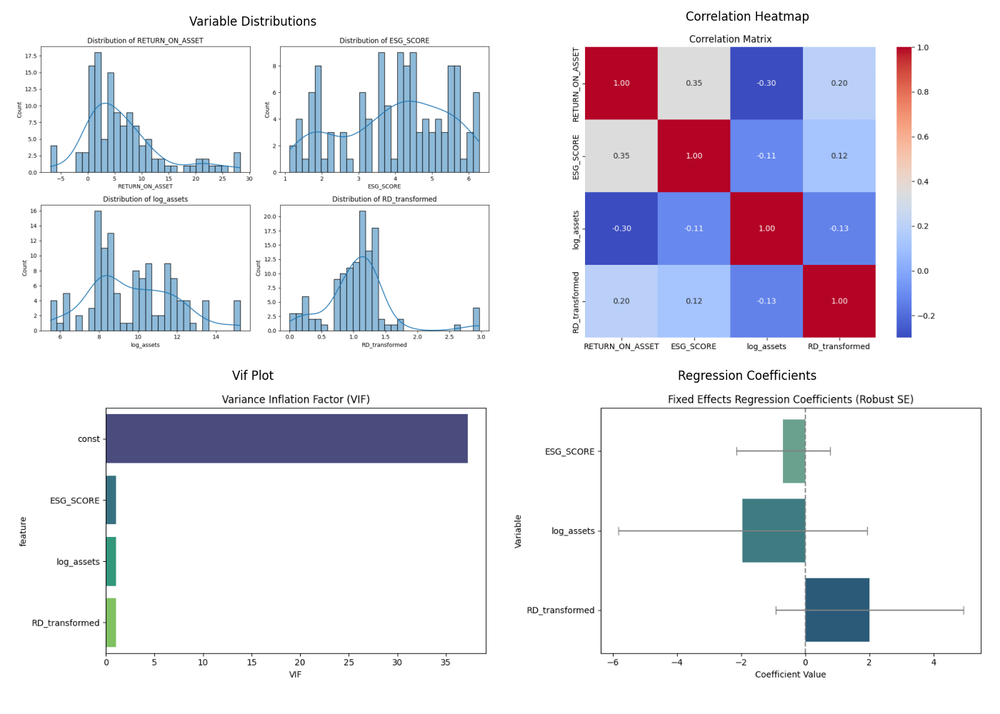

# Final Report: ESG and Financial Performance in Danish Firms

## 1. Overview
This analysis evaluates how ESG scores relate to financial performance (ROA) in publicly listed Danish companies from 2021 to 2024.

## 2. Key Steps
- Outliers removed (ROA < -30%)
- R&D zeros replaced with random values between 1–3
- Log transformation of assets and R&D
- Sector dummies generated

## 3. Descriptive Statistics


## 4. Correlation Matrix


## 5. Multicollinearity (VIF)


## 6. Regression Model
**Model Estimated:**
\[ ROA_{it} = eta_0 + eta_1 ESG_{it} + eta_2 \log(Assets_{it}) + eta_3 RD_{it} + lpha_i + \epsilon_{it} \]

### Regression Output
```
                          PanelOLS Estimation Summary                           
================================================================================
Dep. Variable:        RETURN_ON_ASSET   R-squared:                        0.0482
Estimator:                   PanelOLS   R-squared (Between):             -0.8073
No. Observations:                 123   R-squared (Within):               0.0482
Date:                Tue, Apr 22 2025   R-squared (Overall):             -0.5030
Time:                        18:44:53   Log-likelihood                   -348.12
Cov. Estimator:                Robust                                           
                                        F-statistic:                      1.5034
Entities:                          31   P-value                           0.2192
Avg Obs:                       3.9677   Distribution:                    F(3,89)
Min Obs:                       3.0000                                           
Max Obs:                       4.0000   F-statistic (robust):             1.2670
                                        P-value                           0.2906
Time periods:                       4   Distribution:                    F(3,89)
Avg Obs:                       30.750                                           
Min Obs:                       30.000                                           
Max Obs:                       31.000                                           
                                                                                
                               Parameter Estimates                                
==================================================================================
                Parameter  Std. Err.     T-stat    P-value    Lower CI    Upper CI
----------------------------------------------------------------------------------
const              41.012     35.728     1.1479     0.2541     -29.978      112.00
ESG_SCORE         -1.2543     1.4177    -0.8848     0.3787     -4.0712      1.5626
log_assets        -2.5219     3.6825    -0.6848     0.4952     -9.8390      4.7952
RD_transformed    -4.9905     3.5946    -1.3883     0.1685     -12.133      2.1518
==================================================================================

F-test for Poolability: 4.0706
P-value: 0.0000
Distribution: F(30,89)

Included effects: Entity
```

### Coefficients (Visual)


## 7. Summary Dashboard


---
**✅ Analysis Complete.** All plots, models, and diagnostics are now part of this report.
