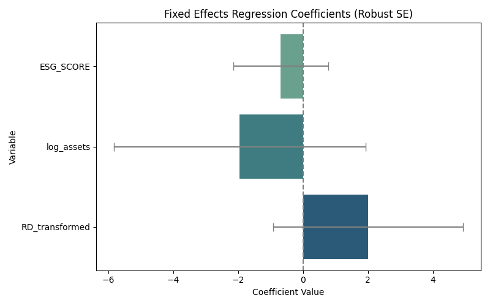

# Final Report: ESG and Financial Performance in Danish Firms

## 1. Overview
This analysis evaluates how ESG scores relate to financial performance (ROA) in publicly listed Danish companies from 2021 to 2024.

## 2. Key Steps
- Outliers removed (ROA < -30%)
- R&D zeros replaced with random values between 1–3
- Log transformation of assets and R&D
- Sector dummies generated

## 3. Descriptive Statistics


## 4. Correlation Matrix


## 5. Multicollinearity (VIF)


## 6. Regression Model
**Model Estimated:**
\[ ROA_{it} = eta_0 + eta_1 ESG_{it} + eta_2 \log(Assets_{it}) + eta_3 RD_{it} + lpha_i + \epsilon_{it} \]

### Regression Output
```
                          PanelOLS Estimation Summary                           
================================================================================
Dep. Variable:        RETURN_ON_ASSET   R-squared:                        0.0191
Estimator:                   PanelOLS   R-squared (Between):             -0.1433
No. Observations:                 123   R-squared (Within):               0.0191
Date:                Tue, Apr 22 2025   R-squared (Overall):             -0.0845
Time:                        19:42:26   Log-likelihood                   -349.97
Cov. Estimator:                Robust                                           
                                        F-statistic:                      0.5784
Entities:                          31   P-value                           0.6307
Avg Obs:                       3.9677   Distribution:                    F(3,89)
Min Obs:                       3.0000                                           
Max Obs:                       4.0000   F-statistic (robust):             0.5214
                                        P-value                           0.6687
Time periods:                       4   Distribution:                    F(3,89)
Avg Obs:                       30.750                                           
Min Obs:                       30.000                                           
Max Obs:                       31.000                                           
                                                                                
                               Parameter Estimates                                
==================================================================================
                Parameter  Std. Err.     T-stat    P-value    Lower CI    Upper CI
----------------------------------------------------------------------------------
const              25.897     39.710     0.6521     0.5160     -53.007      104.80
ESG_SCORE         -0.6903     1.4629    -0.4719     0.6382     -3.5971      2.2165
log_assets        -1.9565     3.8817    -0.5040     0.6155     -9.6694      5.7563
RD_transformed     2.0081     2.9320     0.6849     0.4952     -3.8177      7.8339
==================================================================================

F-test for Poolability: 3.7595
P-value: 0.0000
Distribution: F(30,89)

Included effects: Entity
```

### Coefficients (Visual)


## 7. Summary Dashboard


---
Analysis Complete. All plots, models, and diagnostics are now part of this report.
